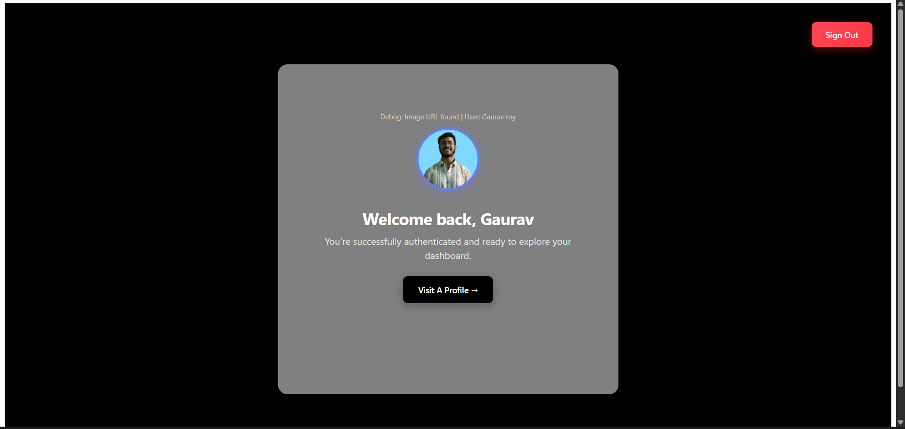

// Docker
// Before starting a backend start a Docker

>>  Open the Docker Application
>> After Open Docker Come in vs-code Terminal run a command 
#  docker-compose up

 >> Your Docker run SuccessFully 

// Backend
git clone <your-repo-url>
cd backend
npm install

# For development
npm run dev

# For production
npm run start

🔗 API Endpoints
📁 Personal Data
POST /api/user/addUserData
Adds a user's personal information.

{
  "name": "John Doe",
  "email": "john@example.com",
  "phone": "1234567890",
  "gender": "Male"
}

// Create a  Crud-Api
>>  This Website create a Api  copy the link and paste in envfile
  # https://crudcrud.com/

 

// Frontend

* Create Frontend Application 
 # npm create vite@latest

 >> Select TypeScript

>> and Install Packages 

* Run command build 
# npm run dev

This project uses **Vite + React + TypeScript**.

### 🖼️ UI Flow

#### 1. Dashboard Landing Page
> _Location_: `http://localhost:5173`  

#### 2. Auth0 Login Page
> _Redirects to Auth0 login_  

#### 3. After Successful Login
> _Dashboard welcomes the logged-in user_  

#### 3. Form Page
> _Update Profile_  

